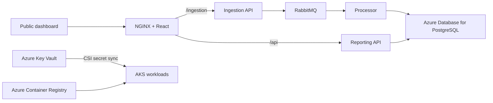

# Smart City Environmental Monitoring Platform

A distributed environmental monitoring system for Indian smart-city zones. IoT readings flow through FastAPI ingestion, RabbitMQ, a Python processor, PostgreSQL, a FastAPI reporting API, and a React dashboard.

## Architecture



## Local Docker Compose

The local setup is unchanged and does not require Azure:

```bash
docker compose up --build
```

Open:

- Dashboard: http://localhost:3000
- API docs through the dashboard proxy: http://localhost:3000/api/docs
- Ingestion docs through the dashboard proxy: http://localhost:3000/ingestion/docs
- RabbitMQ UI: http://localhost:15672 (`guest` / `guest`)

Generate data manually if needed:

```bash
curl -X POST "http://localhost:3000/ingestion/simulate?count=40"
```

## Azure Deployment Architecture

The implemented Azure path uses:

- Azure Kubernetes Service (AKS), Free management tier, one small worker node
- Azure Container Registry (ACR), Basic tier
- Azure Database for PostgreSQL Flexible Server, burstable tier
- Azure Key Vault with the AKS Secrets Store CSI driver
- RabbitMQ inside AKS for the capstone workload
- One Azure Load Balancer public IP for the frontend
- Optional Log Analytics and Application Insights

Azure SQL is intentionally not used. The application uses `psycopg` and PostgreSQL-specific SQL, so Azure Database for PostgreSQL is the compatible managed database.

## Prerequisites

Install Azure CLI, Terraform 1.6 or newer, and kubectl. Then sign in:

```bash
az login
az account list --output table
az account set --subscription "YOUR_SUBSCRIPTION_ID"
az account show --output table
```

Register the required providers:

```bash
az provider register --namespace Microsoft.ContainerService
az provider register --namespace Microsoft.ContainerRegistry
az provider register --namespace Microsoft.DBforPostgreSQL
az provider register --namespace Microsoft.KeyVault
az provider register --namespace Microsoft.OperationalInsights
```

## 1. Create Azure Infrastructure

Keep secrets out of shell history by setting Terraform environment variables. Use strong, URL-safe passwords containing uppercase, lowercase, numbers, and symbols such as `!` or `-` (avoid `/`, `@`, `:`, and spaces).

```bash
export TF_VAR_postgres_admin_password='REPLACE_WITH_STRONG_DATABASE_PASSWORD'
export TF_VAR_rabbitmq_password='REPLACE_WITH_STRONG_RABBITMQ_PASSWORD'

terraform -chdir=infra/terraform init
terraform -chdir=infra/terraform fmt -check
terraform -chdir=infra/terraform validate
terraform -chdir=infra/terraform plan -out=capstone.tfplan
terraform -chdir=infra/terraform apply capstone.tfplan
terraform -chdir=infra/terraform output
```

The defaults create resources in Central India. Override the region if the selected VM/SKU is unavailable:

```bash
terraform -chdir=infra/terraform apply \
  -var="location=South India" \
  -var="postgres_admin_password=$TF_VAR_postgres_admin_password" \
  -var="rabbitmq_password=$TF_VAR_rabbitmq_password"
```

For Azure Monitor and Application Insights, add `-var="enable_monitoring=true"`. Monitoring is off by default to reduce capstone cost.

## 2. Build Images and Deploy to AKS

The script reads Terraform outputs, builds all four images in ACR, renders Kubernetes placeholders, deploys the manifests, waits for every workload, and prints the public URL:

```bash
./scripts/deploy-azure.sh capstone-v1
```

This uses `az acr build`, so Docker does not need to run locally.

Inspect the deployment:

```bash
kubectl get pods -n smart-city
kubectl get services -n smart-city
kubectl get hpa -n smart-city
kubectl logs deployment/processor -n smart-city --tail=100
```

Get the public dashboard URL again:

```bash
export PUBLIC_IP="$(kubectl get service frontend -n smart-city -o jsonpath='{.status.loadBalancer.ingress[0].ip}')"
echo "http://$PUBLIC_IP"
curl "http://$PUBLIC_IP/api/health"
curl "http://$PUBLIC_IP/ingestion/health"
```

Use `http://$PUBLIC_IP` in the capstone video. The frontend proxies `/api` and `/ingestion` internally, so the browser never calls localhost in Azure.

## 3. Verify the Public Demo

```bash
curl -X POST "http://$PUBLIC_IP/ingestion/simulate?count=40"
curl "http://$PUBLIC_IP/api/metrics/latest"
curl "http://$PUBLIC_IP/api/metrics/summary"
```

Open `http://$PUBLIC_IP` in a private browser window to prove it is publicly accessible.

## Azure DevOps CI/CD

Create an Azure Resource Manager service connection with access to the resource group and a Docker Registry service connection to the Terraform-created ACR. Create a variable group named `smart-city-azure`:

| Variable | Value |
| --- | --- |
| `azureServiceConnection` | Azure Resource Manager service connection name |
| `acrServiceConnection` | ACR Docker service connection name |
| `resourceGroup` | `terraform -chdir=infra/terraform output -raw resource_group_name` |
| `acrLoginServer` | `terraform -chdir=infra/terraform output -raw acr_login_server` |
| `aksName` | `terraform -chdir=infra/terraform output -raw aks_cluster_name` |
| `keyVaultName` | `terraform -chdir=infra/terraform output -raw key_vault_name` |
| `keyVaultIdentityClientId` | `terraform -chdir=infra/terraform output -raw key_vault_identity_client_id` |
| `tenantId` | `terraform -chdir=infra/terraform output -raw tenant_id` |

Authorize the variable group and both service connections. The pipeline builds versioned images, renders Key Vault and image placeholders, deploys to AKS, and reports the frontend service.

## Azure Resources Created

Terraform creates:

1. Resource Group
2. AKS cluster with Key Vault CSI add-on and one worker node
3. Basic Azure Container Registry
4. Burstable Azure Database for PostgreSQL Flexible Server and `smartcity` database
5. Azure Key Vault and application secrets
6. AKS-to-ACR pull assignment and Key Vault access policies
7. Optional Log Analytics Workspace and Application Insights

Kubernetes creates RabbitMQ, ingestion, processor, API, frontend, secret synchronization, internal services, an HPA, and one public load balancer service.

## Lowest-Cost Option

For this repository, the lowest-risk capstone deployment is the included short-lived AKS setup: Free AKS management tier, one `Standard_B2s_v2` node, Basic ACR, burstable `B_Standard_B1ms` PostgreSQL, one public IP, and monitoring disabled. AKS management may be free, but the VM, disks, load balancer/public IP, registry, database, bandwidth, and Key Vault operations can still incur charges.

Azure Container Apps Consumption can be cheaper for HTTP services that scale to zero. Here, RabbitMQ and the processor must stay running and PostgreSQL remains billable, so the saving is smaller and it no longer demonstrates the supplied Kubernetes work. Use AKS for the final video, then destroy it promptly. Create an Azure Cost Management budget before deployment and check current regional prices in the Azure Pricing Calculator.

## Cleanup After Submission

First inspect the destructive plan:

```bash
terraform -chdir=infra/terraform plan -destroy \
  -var="postgres_admin_password=$TF_VAR_postgres_admin_password" \
  -var="rabbitmq_password=$TF_VAR_rabbitmq_password"
```

When certain the generated resource group contains only this capstone:

```bash
terraform -chdir=infra/terraform destroy \
  -var="postgres_admin_password=$TF_VAR_postgres_admin_password" \
  -var="rabbitmq_password=$TF_VAR_rabbitmq_password"
```

## Security Notes

- No production secret is stored in Kubernetes YAML or source code; AKS synchronizes Key Vault secrets through CSI.
- The PostgreSQL firewall allows Azure services for this short-lived capstone. Production should use private networking.
- The public URL is HTTP for a demo. Production should add DNS, TLS/HTTPS, authentication, and restrictive CORS.
- Terraform state contains sensitive values. Keep it out of source control; teams should use an encrypted Azure Storage backend.
