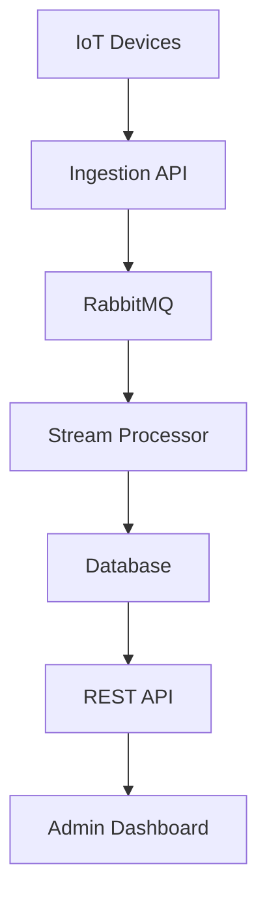

# Project Report: Smart City Environmental Monitoring Platform

## 1. Executive Summary

This project is a modular distributed system for a smart city. It collects real-time environmental data from IoT sensors and shows it to city administrators through a dashboard. The system handles air quality, noise, temperature, and humidity readings.

The main goal is to process high-volume sensor data safely and quickly. To do this, the system uses microservices, RabbitMQ messaging, PostgreSQL for local demo storage, and Azure services for cloud deployment.

## 2. Problem Statement

Cities need to monitor environmental quality continuously. Manual checking is slow and does not give real-time information. This project solves that problem by collecting sensor data automatically and processing it in near real time.

City administrators can use the dashboard to see environmental conditions, identify risky areas, and respond quickly when values cross safe limits.

## 3. Functional Requirements

| Requirement | Explanation |
| --- | --- |
| Ingest sensor data | System must accept IoT readings through an API. |
| Queue messages | Data must be sent to a message queue for reliable processing. |
| Process readings | System must clean, store, and check readings for alerts. |
| Store data | Sensor metadata and readings must be saved in a database. |
| Show dashboard | Admin users must see latest readings, summaries, and alerts. |
| Alert generation | System must create alerts when values cross thresholds. |

## 4. Non-Functional Requirements

| Requirement | Explanation |
| --- | --- |
| Scalability | Services can run with multiple replicas in Kubernetes. |
| Availability | If one service fails, other services can continue working. |
| Reliability | RabbitMQ keeps messages until they are processed. |
| Low latency | API and queue-based processing support near real-time updates. |
| Security | Secrets are stored separately and Key Vault is planned for Azure. |
| Monitoring | Logs and metrics are collected using Azure Monitor and Application Insights. |

## 5. High-Level Architecture

## 6. Microservices

| Service | Responsibility |
| --- | --- |
| Ingestion Service | Accepts sensor readings and publishes them to RabbitMQ. |
| Processor Service | Consumes queue messages, stores data, and creates alerts. |
| API Service | Provides dashboard data through REST endpoints. |
| Frontend Service | Displays charts, readings, and alerts. |

## 7. Messaging and Streaming

RabbitMQ is used as the message queue. It helps to separate the ingestion service from the processor service. If many IoT devices send data at the same time, the queue can hold messages and the processor can handle them one by one or in parallel.

This improves reliability because messages are not lost immediately when a processor is busy. It also improves scalability because more processor replicas can be added.

## 8. Database Design

PostgreSQL is used locally and Azure Database for PostgreSQL Flexible Server is used in Azure. This preserves the same driver, schema, and PostgreSQL query behavior in both environments. Azure Data Explorer can be added later for very large time-series volumes.

### Sensors Table

| Column | Purpose |
| --- | --- |
| sensor_id | Unique sensor ID |
| zone | City area where sensor is installed |
| metric | Type of data, like air quality or noise |
| unit | Measurement unit |
| created_at | Sensor created time |

### Readings Table

| Column | Purpose |
| --- | --- |
| reading_id | Unique reading ID |
| sensor_id | Sensor that sent the data |
| zone | City zone |
| metric | Reading type |
| value | Actual measured value |
| unit | Measurement unit |
| recorded_at | Reading time |

### Alerts Table

| Column | Purpose |
| --- | --- |
| alert_id | Unique alert ID |
| sensor_id | Sensor related to alert |
| zone | Affected city zone |
| metric | Alert metric |
| value | Current value |
| threshold | Safe limit |
| severity | Alert level |
| message | Human-readable alert message |

## 9. API Endpoints

| Endpoint | Method | Purpose |
| --- | --- | --- |
| `/health` | GET | Check API service health |
| `/metrics/latest` | GET | Get latest sensor readings |
| `/metrics/summary` | GET | Get 24-hour metric summary |
| `/zones/summary` | GET | Get zone-wise summary |
| `/alerts` | GET | Get recent alerts |
| `/readings` | POST | Submit one IoT reading |
| `/simulate` | POST | Generate sample readings |

## 10. Containerization and Kubernetes

Each service has its own Dockerfile. This makes the project modular and easy to deploy. Kubernetes manifests are provided for deployments, services, secrets, config maps, and autoscaling.

AKS is used in the cloud design. It can run multiple replicas of services and scale them based on CPU usage.

## 11. CI/CD Pipeline

Azure DevOps pipeline is included. It builds Docker images, pushes them to Azure Container Registry, and deploys Kubernetes manifests to AKS.

The pipeline has staging and production stages. Production deployment can use manual approval.

## 12. Infrastructure as Code

Terraform files are included to create Azure resources:

- Resource Group
- AKS
- ACR
- Azure Database for PostgreSQL Flexible Server
- Azure Key Vault
- Log Analytics
- Application Insights

Using Terraform makes infrastructure repeatable and easy to document.

## 13. Security

Secrets like database connection strings are stored in Kubernetes Secrets for the demo. In Azure, these secrets should be stored in Azure Key Vault. Kubernetes RBAC is used to control access to cluster resources.

Basic security practices:

- Do not hardcode production passwords
- Use Key Vault for secrets
- Use RBAC for user permissions
- Use HTTPS in production
- Monitor logs for suspicious activity

## 14. Monitoring and Alerting

Azure Monitor, Application Insights, and Log Analytics are used in the Azure plan. They help track service health, API latency, error rate, logs, and resource usage.

Alerts can be created for:

- API failure
- High response time
- High CPU usage
- Pod restart count
- Database connection errors

## 15. Cost Management

Azure Cost Management can track spending and create budget alerts. For student demo, use small SKUs and delete resources after submission.

Low-cost choices:

- Basic Azure Container Registry
- Small AKS node size
- Burstable Azure Database for PostgreSQL Flexible Server
- 30-day log retention
- Stop or delete unused resources

## 16. Challenges and Solutions

| Challenge | Solution |
| --- | --- |
| Handling high sensor traffic | Use RabbitMQ queue and scalable processors |
| Avoiding service dependency issues | Use microservices and health checks |
| Storing large sensor data | Use time-series design and indexed queries |
| Cloud deployment complexity | Use Docker, Kubernetes, and Terraform |
| Secret protection | Use Kubernetes Secrets and Azure Key Vault |

## 17. Conclusion

This project shows how a smart city can collect, process, store, and visualize environmental data. It uses distributed system concepts like microservices, messaging, stream processing, containerization, orchestration, CI/CD, monitoring, and cost control.

The system can be improved in the future by adding authentication, Azure Data Explorer integration, caching, anomaly detection, and better map-based visualization.
